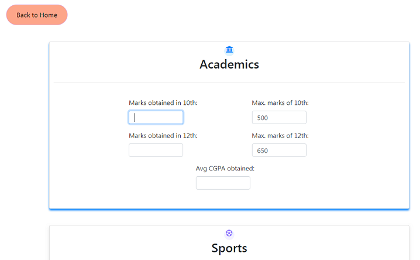
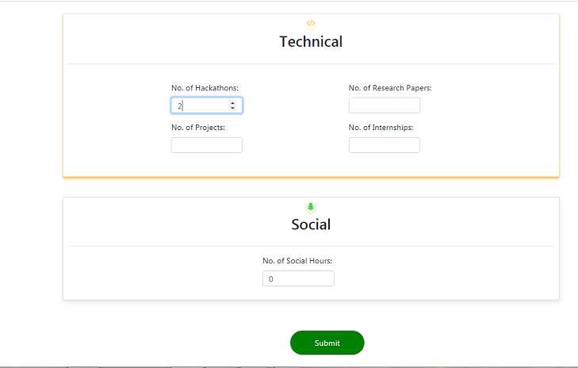
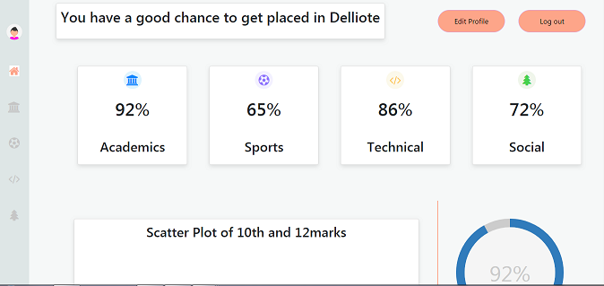
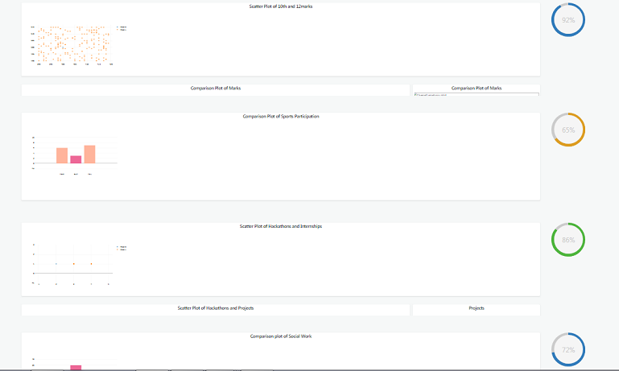

# placement_predictor
Our system maintain student's performance for academics, sports, technical and other extra co-curricular activities and analyzes it using machine learning and  rate students on different parameters and also calculate the probability of student getting placed in companies as per the current requirement of industries.

login_page

profile_page_view_0

profile_page_view_1

home_page_view_0

home_page_view_1

